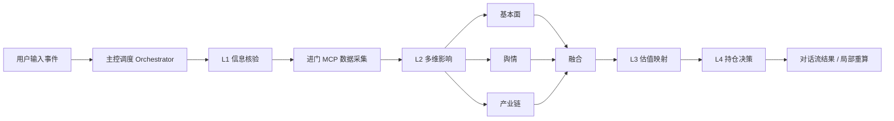

# FinEventAgent · 上市公司重大事件影响分析助手

输入一段上市公司重大事件描述，系统按投研决策链自动完成：

**确认事实 → 分析影响 → 重估价值 → 输出操作建议**


## 产品定位

面向买方/卖方研究员的**事件驱动投研分析助手**。解决三类痛点：

| 痛点 | FinEventAgent 的做法 |
|---|---|
| 信息分散、核验耗时 | L1 自动比对官方披露与多源数据，输出置信度 |
| 分析口径不统一 | L1-L4 固定框架，结构化输出、口径一致 |
| 结论难追溯 | 每层结论可溯源，可穿透到底层指标与公告 |

**设计原则**：准确的数据、稳定的 Agent 调用、简洁的用户体验。

## 架构设计

采用「**主控 Orchestrator + L1-L4 分层 Agent**」，对应研究员认知链：



| 层级 | 回答的问题 | 关键输出 |
|---|---|---|
| **主控** | 如何编排与局部重算？ | 会话上下文、SSE 进度、层间 Schema |
| **L1 信息核验** | 事实是什么？可信吗？ | EventProfile、核验状态、置信度 |
| **L2 多维影响** | 基本面/舆情/产业链如何变化？ | 影响矩阵、情绪分布、传导判断 |
| **L3 估值映射** | 合理估值中枢如何变化？ | PE / DCF 影响区间、假设与敏感性 |
| **L4 持仓决策** | 给定仓位与约束怎么做？ | 建议、三情景、风险与观察点 |

层间只传递结构化 Schema，不直接传递自由文本；L2 内部并行，失败可降级；支持从指定层向下重算。

## 交互设计

- **对话流**：输入事件后，L1 → 数据采集 → L2 → L3 → L4 逐层展开
- **可视化**：舆情情绪/渠道/热度图；估值前后对比；进门 MCP 底层指标卡
- **继续分析**：改持仓、调估值参数、刷新舆情或底层数据；展示前后对比
- **溯源**：核验依据、公告来源、计算公司可点击查看

## 快速开始

```bash
pip install -r demo/requirements.txt
cp .env.example .env   # 可选：填写 LLM / 进门 MCP Key
python run.py          # http://localhost:8000
```

Windows：

```powershell
$env:PYTHONPATH = "$PWD"; python run.py
```

## 运行模式与配置

| 模式 | 条件 | 说明 |
|---|---|---|
| `live` | LLM Key + 进门 MCP Key | 实时数据 + LLM 增强 |
| `hybrid` | 仅进门 MCP Key | 实时数据 + 规则分析（无 LLM 可完整跑通） |
| `demo` | 均无 Key | 本地样例，离线可演示 |

**统一配置**：`demo/config/analysis.json`（`runtime` / `llm` / `sentiment` / `valuation`）  
**密钥**：仅环境变量 `.env` 中的 `LLM_API_KEY`、`JINMEN_MCP_KEY`（不入库）

LLM 只增强「事件抽取」与「基本面叙述」；估值、策略、MCP、舆情主链路不依赖大模型。公网部署可将 `llm.enabled=false`，或把 `base_url` / `model` 指到可达的 OpenAI 兼容端点。

## 项目结构

```
├── run.py
├── .env.example
├── demo/
│   ├── app.py                 # /api/health · /api/analyze · /api/refine
│   ├── config/analysis.json   # 统一业务与 LLM 配置
│   ├── agent/                 # Orchestrator + L1-L4 + MCP/LLM
│   ├── static/                # 对话流前端
│   └── scripts/               # 辅助脚本
└── LICENSE
```

## API

- `GET /api/health` — 模式与配置摘要
- `POST /api/analyze` — SSE 全量分析
- `POST /api/refine` — SSE 局部重算（`session_id` + 目标层）

## License

MIT
